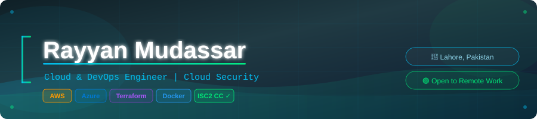

<!-- Header Banner -->
<p align="center">
  
</p>

<!-- Typing SVG -->
<p align="center">
  
</p>

<!-- Badges Row -->
<p align="center">
  
  
  
  
</p>

<br/>

---

## 👾 About Me

```bash
$ cat about.txt

  Name     : Rayyan Mudassar
  Role     : Cloud & DevOps Engineer | Cloud Security Enthusiast
  Location : Lahore, Pakistan (Remote-First)
  Goal     : Secure, automated, scalable cloud infrastructure
  Learning : AWS SAA-C03 → Kubernetes → EKS → Cloud Security Engineering
  Status   : Actively building. Actively applying. 🚀
```

> Self-taught Cloud & Security Engineer building production-grade infrastructure on AWS.
> I automate everything, secure what matters, and document the journey.

<br/>

---

## 🛡️ Certifications

<p>
  
  
  
</p>

---

## ⚡ Tech Stack

**Cloud & Infrastructure**

<p>
  
  
  
  
  
</p>

**Automation & Security**

<p>
  
  
  
  
  
</p>

**AWS Services I've shipped projects with**

<p>
  
  
  
  
  
  
  
  
  
</p>

---

## 🚀 Portfolio Projects

| # | Project | Stack | Highlights |
|---|---------|-------|------------|
| 🔐 | **[AWS Security Auditor CLI](https://github.com/Rayyan-Mudassar/AWS-Security-Audit)** | Python · boto3 · AWS | Audits S3, IAM, Security Groups & CloudTrail misconfigs with before/after outputs |
| ⚙️ | **[Terraform + GitHub Actions CI/CD](https://github.com/Rayyan-Mudassar/Terraform_project)** | Terraform · GH Actions · AWS | Automated infra provisioning with full plan/apply pipeline |
| 🐳 | **[Dockerized Flask + Postgres API](https://github.com/Rayyan-Mudassar/Docker-Kubernetes-Labs)** | Docker · Flask · Postgres | Multi-stage builds, named volumes, non-root hardening, race condition fixed |
| ⚡ | **[Serverless Notes API](https://github.com/Rayyan-Mudassar/AWS-Serverless-NotesApp)** | Lambda · DynamoDB · API GW | Fully serverless CRUD backend, debugged HTTP vs REST API event structures |
| 🌐 | **[Nodejs App with ECS + CI/CD](https://github.com/Rayyan-Mudassar/Nodejs-Docker-DevOps)** | S3 · CloudFront · OAC | HTTPS enforcement, OAC config, debugged 403 endpoint issue |

---

## 📊 GitHub Stats

<p align="center">
  
  
</p>

<p align="center">
  
</p>

---

## 🎯 Currently Working On

```yaml
current_focus:
  - 📚 AWS Solutions Architect Associate (SAA-C03)
  - ☸️  Kubernetes + Docker Advanced
  - 🔒 Cloud Security Engineering path
  - 🤖 AI Automation on AWS Bedrock (upcoming)

open_to:
  - Remote Cloud / DevOps / Security roles
  - Visa-sponsored positions internationally
  - Freelance cloud infrastructure projects
```

---

## 📬 Connect With Me

<p>
  <a href="https://github.com/Rayyan-Mudassar">
    
  </a>
  <a href="https://www.linkedin.com/in/rayyan-mudassar">
    
  </a>
</p>

> 💡 *"Infrastructure as code. Security as culture. Automation as default."*

<!-- Footer -->
<p align="center">
  
</p>
